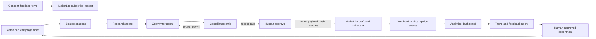

# Agentic AI for Email Marketing Campaign

Public learner resources for **TGS-2026064473**, a two-day WSQ course by Tertiary Infotech Academy Pte Ltd.

The course builds one controlled n8n and MailerLite campaign loop: collect consented leads, coordinate specialist newsletter agents, require human approval before scheduling, measure campaign events, and turn evidence into the next controlled experiment.

## Campaign architecture

The content agents propose and critique. Deterministic workflow nodes validate contracts and perform API writes. A human owns every action that can change an external audience or irreversible campaign state.

## Labs

| Lab | Outcome | Primary files |
|---|---|---|
| 1. Consent-First Lead Capture | Validate explicit consent and upsert a MailerLite subscriber | n8n JSON, sample leads, checklist |
| 2. Campaign Brief and Audience Contract | Convert an objective into a versioned agent context | n8n JSON, campaign brief, brand guidelines |
| 3. Multi-Agent Newsletter Editorial System | Coordinate strategist, researcher, copywriter, critic and refiner roles | n8n JSON, output schema, approved sources |
| 4. Human Approval and MailerLite Scheduling | Bind approval to the exact payload before creating and scheduling a campaign | n8n JSON, approved newsletter, checklist |
| 5. MailerLite Campaign Analytics Dashboard | Fetch and validate live campaign statistics, calculate labelled KPIs and render a diagnostic dashboard | n8n JSON, report data, dashboard HTML |
| 6. Trend and Feedback Optimization Agent | De-identify feedback, build evidence cards and propose a reversible experiment | n8n JSON, feedback data, experiment contract |

Start with the [labs index](labs/README.md). Each lab folder is self-contained and includes a detailed README, acceptance checklist, importable n8n workflow and safe sample data.

## Learner resources

- [Learner Guide (Markdown)](LG-Agentic%20AI%20for%20Email%20Marketing%20Campaign.md)
- [Learner Guide (PDF)](courseware/LG-Agentic%20AI%20for%20Email%20Marketing%20Campaign.pdf)
- [Course slides (PDF)](courseware/Agentic%20AI%20for%20Email%20Marketing%20Campaign-v1.1.pdf)

The slides are concept-led. Detailed click paths, tests, evidence requirements and acceptance criteria are in the Learner Guide and lab folders.

## Safe use

- Use a training n8n workspace, sample leads and a non-production MailerLite group.
- Store live tokens only in n8n Credentials; never commit or paste them into workflow JSON.
- Do not silently resubscribe an unsubscribed person.
- Do not create, schedule or send to a production audience without an authenticated human approval bound to the exact payload.
- Remove credentials and unnecessary personal data from screenshots and evidence.

## Technical references

- [n8n AI Agent node](https://docs.n8n.io/integrations/builtin/cluster-nodes/root-nodes/n8n-nodes-langchain.agent/)
- [n8n human-in-the-loop tool calls](https://docs.n8n.io/advanced-ai/human-in-the-loop-tools/)
- [MailerLite Subscribers API](https://developers.mailerlite.com/api/subscribers)
- [MailerLite Campaigns API](https://developers.mailerlite.com/api/campaigns)
- [MailerLite Webhooks API](https://developers.mailerlite.com/api/webhooks)

## Licence and support

Copyright 2026 Tertiary Infotech Academy Pte Ltd. All rights reserved. For course enquiries, visit the [official course page](https://www.tertiarycourses.com.sg/casl-agentic-ai-for-email-marketing-campaign.html).
