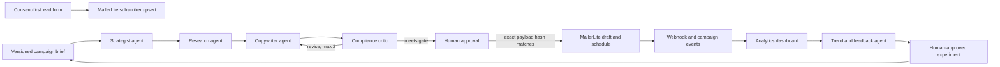

# Agentic AI for Email Marketing Campaign

A two-day WSQ course that builds one controlled n8n and MailerLite campaign loop: capture consented leads, coordinate specialist newsletter agents, require human approval before scheduling, measure campaign events, and turn that evidence into the next controlled experiment.

| Course detail | Information |
|---|---|
| Course code | `TGS-2026064473` |
| Programme | WSQ |
| Duration | 2 days, 16 hours (including 2 hours of assessment) |
| Registration | [View course details and register](https://www.tertiarycourses.com.sg/casl-agentic-ai-for-email-marketing-campaign.html) |
| Funding | Up to 70% SSG funding for eligible Singapore Citizens and PRs. Eligibility and terms apply; confirm current rates on the course page. |
| Provider | Tertiary Infotech Academy Pte Ltd |

## About the course

Email marketing teams are adopting AI agents faster than they are adopting the controls that make those agents safe to run against a real audience. This course treats that gap as the design problem.

Over six connected labs you build a single campaign system in n8n and MailerLite. Content agents propose and critique; deterministic workflow nodes validate contracts and perform every API write; and a human owns every action that can change an external audience or create irreversible campaign state. You finish with a working pipeline, the evidence trail behind it, and a defensible account of where the automation stops and human judgement begins.

## Learning outcomes

By the end of the course you will be able to:

- **LO1** — Implement email marketing campaigns in alignment to strategic marketing objectives.
- **LO2** — Analyse email marketing campaign outcomes using sales performance data and consumer insights.
- **LO3** — Analyse market trends and customer reviews.

## Topics covered

1. **Implementing Agentic AI Email Marketing Campaigns** — consent-first lead capture, machine-readable campaign briefs, specialist agent boundaries, and deterministic human approval before any external send.
2. **AI-Driven Campaign Performance and Consumer Insights Analysis** — fetching and validating live campaign statistics, defining labelled KPIs, and reading a diagnostic dashboard rather than a vanity one.
3. **AI Agent Analysis of Market Trends and Customer Feedback** — de-identifying feedback, building traceable evidence cards, and proposing reversible experiments that feed the next campaign brief.

## Labs

Six connected labs build one campaign system. Each folder is self-contained, with a detailed README, an acceptance checklist, an importable n8n workflow and safe sample data. Start at the [labs index](labs/README.md).

| Lab | Outcome | Alignment | Duration |
|---|---|---|---|
| [1. Consent-First Lead Capture to MailerLite](labs/lab-01-consent-first-lead-capture-to-mailerlite/README.md) | Validate explicit consent and upsert a MailerLite subscriber without overwriting unsubscribe state | LO1 \| K3 \| A1 | 75 min |
| [2. Campaign Brief and Audience Contract](labs/lab-02-campaign-brief-and-audience-contract/README.md) | Convert a marketing objective into a versioned, validated agent context | LO1 \| K1-K2 | 60 min |
| [3. Multi-Agent Newsletter Editorial System](labs/lab-03-multi-agent-newsletter-editorial-system/README.md) | Coordinate strategist, researcher, copywriter and compliance critic roles with a bounded revision loop | LO1 \| K1-K2 \| A2 | 120 min |
| [4. Human Approval and MailerLite Scheduling](labs/lab-04-human-approval-and-mailerlite-scheduling/README.md) | Bind approval to the exact payload hash before creating and scheduling a campaign | LO1 \| K4 \| A3 | 105 min |
| [5. MailerLite Campaign Analytics Dashboard](labs/lab-05-mailerlite-campaign-analytics-dashboard/README.md) | Fetch and validate live campaign statistics, calculate labelled KPIs and render a diagnostic dashboard | LO2 \| K5 \| A4 | 120 min |
| [6. Trend and Customer Feedback Optimization Agent](labs/lab-06-trend-and-customer-feedback-optimization-agent/README.md) | De-identify feedback, build evidence cards and propose a reversible experiment | LO3 \| K6 \| A5 | 90 min |

## What is in this repository

| Resource | Description |
|---|---|
| [Learner Guide (Markdown)](LG-Agentic%20AI%20for%20Email%20Marketing%20Campaign.md) | Full guide with detailed procedures, acceptance criteria, evidence requirements and troubleshooting |
| [Learner Guide (PDF)](courseware/LG-Agentic%20AI%20for%20Email%20Marketing%20Campaign.pdf) | Print-ready version of the same guide |
| [Course slides (PDF)](courseware/Agentic%20AI%20for%20Email%20Marketing%20Campaign-v1.1.pdf) | Concept-led deck used in class |
| [`labs/`](labs/) | Six lab folders with n8n workflow exports, sample data and checklists |

The slides stay concept-led on purpose. Click paths, tests, evidence requirements and acceptance criteria live in the Learner Guide and the individual lab folders.

Current courseware version: **v1.1**.

## Public and private materials

This repository is the **public** learner-facing package only. Assessment papers, answer keys, marking guides, trainer-only references and all credentials are held privately by Tertiary Infotech Academy and are deliberately excluded from this repository. Assessment materials are issued through the official course channels.

## Safe use

- Use a training n8n workspace, sample leads and a non-production MailerLite group.
- Store live tokens only in n8n Credentials; never commit them or paste them into workflow JSON.
- Do not silently resubscribe someone who has unsubscribed.
- Do not create, schedule or send to a production audience without an authenticated human approval bound to the exact payload.
- Remove credentials and unnecessary personal data from screenshots and evidence.

All sample data in this repository is synthetic and uses `example.com` addresses.

## Technical references

- [n8n AI Agent node](https://docs.n8n.io/integrations/builtin/cluster-nodes/root-nodes/n8n-nodes-langchain.agent/)
- [n8n human-in-the-loop tool calls](https://docs.n8n.io/advanced-ai/human-in-the-loop-tools/)
- [MailerLite Subscribers API](https://developers.mailerlite.com/api/subscribers)
- [MailerLite Campaigns API](https://developers.mailerlite.com/api/campaigns)
- [MailerLite Webhooks API](https://developers.mailerlite.com/api/webhooks)

## Licence and support

Copyright 2026 Tertiary Infotech Academy Pte Ltd. All rights reserved.

For course enquiries, schedules and registration, visit the [official course page](https://www.tertiarycourses.com.sg/casl-agentic-ai-for-email-marketing-campaign.html).
